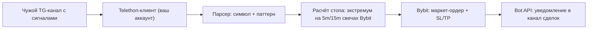

# TG Crypto Signals Bot

Бот читает сигналы из чужого Telegram-канала вида:

```
Актив GRAMUSDT, паттерн `Двойная вершина`
Актив MNTUSDT, паттерн `Двойное дно`
```

Актив может быть любым — символ вытаскивается из текста регуляркой, никакой жёсткой привязки к конкретной монете нет.

и автоматически открывает фьючерсную сделку на Bybit:

- направление определяется по паттерну (`Двойная вершина` → шорт, `Двойное дно` → лонг);
- стоп-лосс ставится за ближайшим свинг-экстремумом на 5-минутных или 15-минутных свечах (настраивается);
- тейк-профит считается по соотношению риск/прибыль (по умолчанию 1:2, настраивается);
- размер сделки — фиксированная сумма в USDT с заданным плечом.

Так как канал-источник вам не принадлежит, чтение сообщений идёт через **пользовательскую** Telegram-сессию (библиотека Telethon), а не через Bot API — бот подключается как обычный аккаунт-подписчик канала. А вот обо всех сделках бот отдельно пишет в свой собственный Telegram-канал/чат через Bot API (токен от @BotFather) — это удобно, потому что не зависит от вашей личной сессии и можно добавить туда кого угодно для наблюдения.

## Как это работает



## Структура проекта

```
bot/
  config.py     - настройки из .env (pydantic-settings)
  parser.py     - разбор текста сигнала, маппинг паттерн -> направление
  stops.py      - поиск свинг-экстремума на свечах Bybit для стопа
  exchange.py   - обёртка над Bybit V5 (pybit): плечо, объём, ордер с SL/TP
  listener.py   - Telethon-клиент, подписка на новые сообщения канала
  notifier.py   - отправка уведомлений о сделках в TG-канал через Bot API
  list_chats.py - утилита: список ваших чатов с ID/username (поиск TG_SOURCE_CHAT)
  main.py       - точка входа, связывает всё вместе
requirements.txt
.env.example
Dockerfile
docker-compose.yml
```

## 1. Получение ключей

### Telegram (api_id / api_hash)

1. Зайдите на https://my.telegram.org/apps под своим аккаунтом.
2. Создайте приложение, получите `api_id` и `api_hash`.

   Если сайт не открывается или при создании приложения выдаёт голый `ERROR` — это, скорее всего, DNS-блокировка `my.telegram.org` в РФ в сочетании с антифродом, который сверяет страну IP и страну регистрации номера. Решение: **не используйте VPN**, а вместо этого пропишите IP сайта напрямую в `/etc/hosts` (на macOS/Linux):

   ```bash
   sudo sh -c 'echo "149.154.167.220 my.telegram.org" >> /etc/hosts'
   sudo dscacheutil -flushcache; sudo killall -HUP mDNSResponder   # macOS
   ```

   После этого `my.telegram.org` откроется напрямую с вашего реального IP, антифрод пропустит создание приложения.

3. Узнайте username канала-источника (без `@`) либо его числовой ID — **не название канала**, отображаемое в шапке чата (оно может содержать похожие по написанию символы или измениться). Ваш аккаунт должен состоять в этом канале/чате (быть подписанным), иначе Telethon не сможет получить доступ к сообщениям.

   Если у канала нет публичного `@username` или вы не уверены в точном ID — заполните `TG_API_ID`/`TG_API_HASH`/`TG_SESSION_NAME` в `.env` и запустите:

   ```bash
   python -m bot.list_chats
   ```

   Скрипт авторизуется (как и основной бот, при первом запуске спросит код подтверждения) и выведет таблицу `ID | Username | Название` по всем вашим чатам и каналам — оттуда возьмите нужный ID для `TG_SOURCE_CHAT`. Можно отфильтровать по подстроке названия: `python -m bot.list_chats screener`.

   Скрипт безопасно запускать даже пока основной бот уже работает — он использует временную копию файла сессии, чтобы не ловить `sqlite3.OperationalError: database is locked` из-за одновременного доступа двух процессов к одному файлу.

### Bybit API-ключи

1. В личном кабинете Bybit создайте API-ключ с правами на **Contract Trading** (фьючерсы) — чтение и торговля. Вывод средств (Withdraw) включать не нужно.
2. Для теста без реальных денег есть два варианта — см. раздел [«Тестовый запуск без реальных денег»](#тестовый-запуск-без-реальных-денег) ниже.

### Канал/чат для уведомлений о сделках (Bot API)

1. Создайте бота через [@BotFather](https://t.me/BotFather) и получите его токен, впишите в `NOTIFY_BOT_TOKEN`. Считайте токен секретом: не публикуйте и не коммитьте `.env`.
2. Создайте (или используйте существующий) канал/группу, куда бот будет писать о сделках, и добавьте туда бота **администратором** с правом публикации сообщений.
3. Узнайте `chat_id`:
   - для публичного канала можно просто указать `@username_канала` в `NOTIFY_CHAT_ID`;
   - для приватного канала: отправьте в канал любое сообщение, затем откройте в браузере
     `https://api.telegram.org/bot<TOKEN>/getUpdates` (подставьте свой токен) и найдите в ответе `"chat":{"id": -100...}` — это и есть нужный `chat_id`.
4. Впишите значение в `NOTIFY_CHAT_ID` в `.env`.

## 2. Настройка

Скопируйте `.env.example` в `.env` и заполните:

```bash
cp .env.example .env
```

Основные параметры:

| Переменная | Описание |
|---|---|
| `TG_API_ID`, `TG_API_HASH` | ключи с my.telegram.org |
| `TG_SOURCE_CHAT` | username канала-источника (без `@`) или числовой ID — не название канала! Найти можно через `python -m bot.list_chats` |
| `NOTIFY_BOT_TOKEN` | токен бота-нотификатора от @BotFather |
| `NOTIFY_CHAT_ID` | ID/username канала или чата, куда бот пишет о сделках |
| `BYBIT_API_KEY`, `BYBIT_API_SECRET` | ключи Bybit |
| `BYBIT_TESTNET` | `true` для тестовой сети (testnet.bybit.com), `false` для mainnet |
| `BYBIT_DEMO` | `true` для Demo Trading на mainnet (виртуальный баланс, реальные котировки). Нельзя вместе с `BYBIT_TESTNET` |
| `ORDER_SIZE_USDT` | фиксированный размер маржи на сделку в USDT |
| `LEVERAGE` | плечо |
| `RISK_REWARD` | соотношение тейк/стоп, по умолчанию `2.0` (то есть 1:2) |
| `STOP_TIMEFRAME` | таймфрейм для поиска экстремума под стоп: `5` или `15` |
| `STOP_OFFSET_PCT` | доп. отступ стопа за экстремум, в процентах |
| `SWING_WINDOW` | сколько свечей слева/справа должно быть "ниже/выше", чтобы точка считалась экстремумом |
| `MAX_SIGNAL_AGE_SECONDS` | игнорировать сигналы старше этого возраста (сек) |
| `DRY_RUN` | `true` — только считать и логировать план сделки, ордер не отправляется |

## Тестовый запуск без реальных денег

Прежде чем пускать бота торговать реальными деньгами, есть два независимых уровня проверки — их можно и нужно комбинировать.

### Уровень 1: `DRY_RUN=true` — вообще без ордеров

Бот делает всё как обычно (слушает канал, парсит сигнал, тянет свечи, считает стоп/тейк/объём), но вместо реального ордера просто отправляет план сделки в канал уведомлений и ничего не отправляет на биржу. Не нужны специальные ключи — подходит для проверки парсинга сигналов и корректности расчётов.

```env
DRY_RUN=true
```

### Уровень 2: Bybit Demo Trading — полный цикл, но виртуальные деньги

Следующий шаг — прогнать бота с реальной отправкой ордеров, но на "бумажном" балансе Bybit (**Demo Trading**, не путать с Testnet):

- котировки и исполнение максимально приближены к реальному mainnet (в отличие от testnet, где мало ликвидности и ордера иногда не исполняются);
- баланс полностью виртуальный, реальные деньги не участвуют.

Как включить:

1. В веб-интерфейсе Bybit переключитесь на **Demo Trading** (аватар пользователя → Demo Trading) — это отдельный аккаунт со своим ID.
2. Внутри Demo Trading создайте отдельный API-ключ (обычные ключи с mainnet не подойдут).
3. В `.env`:

```env
BYBIT_API_KEY=ваш_demo_ключ
BYBIT_API_SECRET=ваш_demo_секрет
BYBIT_TESTNET=false
BYBIT_DEMO=true
DRY_RUN=false
```

`BYBIT_TESTNET` и `BYBIT_DEMO` взаимоисключающие — бот сам откажется стартовать, если включены оба.

Когда всё проверено на Demo Trading и результаты устраивают — просто замените ключи на боевые и выставьте `BYBIT_DEMO=false` (при этом `BYBIT_TESTNET` тоже должен остаться `false`).

## 3. Запуск локально (без Docker)

```bash
python3 -m venv .venv
source .venv/bin/activate
pip install -r requirements.txt
python -m bot.main
```

При первом запуске Telethon запросит номер телефона и код подтверждения (придёт в Telegram) — это нужно один раз, дальше сессия сохранится в файл `session/user.session`.

## 4. Запуск на VPS через Docker

### Установка Docker (если ещё не установлен)

```bash
curl -fsSL https://get.docker.com | sh
sudo usermod -aG docker $USER
# перелогиньтесь (exit и снова зайдите по SSH), чтобы группа docker применилась
```

### Клонирование репозитория с GitHub

```bash
git clone https://github.com/kaznikit/tg-crypto-signals-bot.git
cd tg-crypto-signals-bot
cp .env.example .env
nano .env   # заполните все значения, см. разделы выше
```

### Первый запуск (авторизация Telegram)

Первый запуск — **интерактивно**, чтобы авторизовать Telegram-сессию:

```bash
docker compose build
docker compose run --rm bot
```

Введите номер телефона и код подтверждения. После того как в логе появится "Telegram-клиент запущен как ...", остановите контейнер (`Ctrl+C`) — файл сессии уже сохранён в `./session` на хосте.

**Важно:** `docker compose run --rm bot` нужен только один раз, для самой первой авторизации, пока файла сессии ещё нет. Как только сессия создана и бот переведён на `docker compose up -d` — больше никогда не запускайте `docker compose run --rm bot` (без указания другой команды), пока основной контейнер уже работает: это создаёт **второй** процесс, который откроет тот же файл сессии параллельно с первым, и оба упадут с `sqlite3.OperationalError: database is locked`. Для повторной интерактивной авторизации (например, если сессия слетела) сначала остановите основной контейнер: `docker compose down`.

Дальше запускайте в фоне как обычный сервис:

```bash
docker compose up -d
docker compose logs -f
```

Бот сам поднимется после перезагрузки VPS (`restart: unless-stopped`) и переиспользует сохранённую сессию из `./session`.

### Обновление бота на VPS

```bash
cd tg-crypto-signals-bot
git pull
docker compose build
docker compose up -d
```

Файл сессии (`./session`) и `.env` не трогаются при обновлении — повторная авторизация не потребуется.

### Альтернатива: systemd (без Docker)

```bash
git clone https://github.com/kaznikit/tg-crypto-signals-bot.git /opt/tg-crypto-signals-bot
cd /opt/tg-crypto-signals-bot
python3 -m venv .venv
.venv/bin/pip install -r requirements.txt
cp .env.example .env
nano .env   # заполните все значения
```

```ini
# /etc/systemd/system/tg-crypto-signals-bot.service
[Unit]
Description=TG Crypto Signals Bot
After=network.target

[Service]
WorkingDirectory=/opt/tg-crypto-signals-bot
ExecStart=/opt/tg-crypto-signals-bot/.venv/bin/python -m bot.main
Restart=on-failure
EnvironmentFile=/opt/tg-crypto-signals-bot/.env

[Install]
WantedBy=multi-user.target
```

Первый запуск для авторизации всё равно нужно сделать вручную в терминале (`python -m bot.main`), затем уже включать через systemd:

```bash
sudo systemctl daemon-reload
sudo systemctl enable --now tg-crypto-signals-bot
```

Обновление до последней версии из GitHub:

```bash
cd /opt/tg-crypto-signals-bot
git pull
.venv/bin/pip install -r requirements.txt
sudo systemctl restart tg-crypto-signals-bot
```

## Логика расчёта сделки

1. Парсится сообщение: символ (например, `GRAMUSDT`, `MNTUSDT` — любой актив) и паттерн (`Двойная вершина` / `Двойное дно`). Остальные паттерны игнорируются.
2. Если по символу уже есть открытая позиция — сигнал пропускается (уведомление в канал сделок).
3. Загружаются последние закрытые свечи выбранного таймфрейма (5m/15m) и ищется ближайший (самый свежий) свинг-хай (для шорта) или свинг-лоу (для лонга) — точка, которая выше/ниже `SWING_WINDOW` соседних свечей с каждой стороны.
4. Стоп = экстремум + отступ `STOP_OFFSET_PCT`% (за хай для шорта, за лоу для лонга).
5. Вход — рыночный ордер, объём считается из `ORDER_SIZE_USDT * LEVERAGE / цена`, округляется вниз до шага лота инструмента.
6. Тейк = вход ± (риск на юнит × `RISK_REWARD`), стоп и тейк выставляются вместе с ордером через Bybit API (`stopLoss`/`takeProfit`).
7. Обо всех действиях (открыл сделку / пропустил / ошибка) бот пишет в настроенный канал уведомлений через Bot API.

## Важно

- По умолчанию (`DRY_RUN=false`, `BYBIT_TESTNET=false`, `BYBIT_DEMO=false`) бот торгует реальными деньгами на mainnet. Перед боевым запуском обязательно пройдите оба уровня теста из раздела [«Тестовый запуск без реальных денег»](#тестовый-запуск-без-реальных-денег).
- Плечо, размер сделки и риски — полностью на вашей ответственности. Без успешного расчёта стопа сделка не открывается.
- Не публикуйте `.env` и содержимое папки `session/` — там ключи API, токен бота-нотификатора и авторизованная сессия Telegram.
